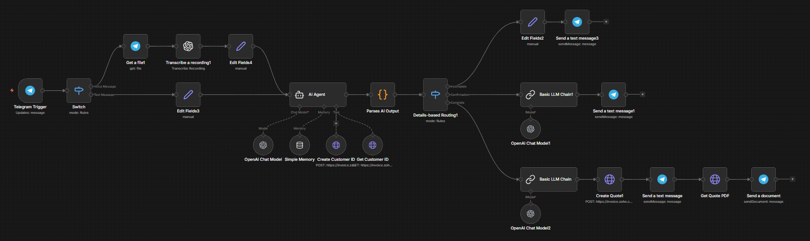

# Telegram Zoho Quote Automation (n8n)

An AI-powered automation workflow built in n8n that enables users to generate quotes directly from Telegram using natural language and voice messages, with automatic customer management and PDF delivery via Zoho Invoice.

---

## 📌 Overview

This project connects Telegram, OpenAI, and Zoho Invoice (Zoho Books API) to build a conversational quotes generation system.

Users can send messages like:

- Create a quotation for 3 adults and 2 kids for Mangrove tour, due next Friday for $560 in total.
- Generate quote for Desert Safari for 4 adults at cost $200.
- Apply 10% discount and set due date 25 December 
- Confirm  

The workflow processes the message, extracts structured quote details using AI, checks/creates the customer in Zoho, generates the quotation, and sends the PDF back to the user via Telegram.

---

## 🏗️ Workflow Architecture

### Main Components

- Telegram Trigger  
- Switch Node (Text / Voice handling)  
- Get File (for voice messages)  
- OpenAI Transcription (voice to text)  
- Edit Fields (preprocessing)  
- AI Agent (intent detection + quote extraction)  
- Parse AI Output  
- Customer Tools:
  - Get Customer ID  
  - Create Customer  
- Quote Processing:
  - Create Quotation  
- Get PDF (Quotation) 
- Telegram Send Message  
- Telegram Send Document (PDF delivery)

---

## 🔄 Workflow Visual

---

## 🧠 How It Works

### 1. User Input (Telegram)
- Accepts text messages  
- Accepts voice messages (automatically transcribed)  

### 2. AI Processing
The AI Agent:
- Detects quote intent  
- Extracts:
  - Client name  
  - Due date  
  - Discount  
  - Items/services  
  - Adult & Kids counts (separated into distinct line items)  
- Generates structured quote JSON  
- Handles multi-turn confirmations  

### 3. Customer Handling (Automated)
The workflow:
- Searches for customer using Zoho API  
- If not found → Automatically creates a new customer  
- Ensures `customer_id` is always available before quote creation  

### 4. Quote Creation
Depending on confirmation:

- Creates a **Quotation**
- Applies:
  - Currency  
  - Exchange rate (if required)  
  - Entity-level discount  
  - Due date  
  - Custom quote subject  

### 5. PDF Generation & Delivery
- Downloads the generated PDF from Zoho  
- Sends it directly to the initiating Telegram user  

---

## 🛠️ Tech Stack

- n8n (Workflow Automation)  
- Telegram Bot API  
- OpenAI (Chat Model + Audio Transcription)  
- Zoho Invoice (Zoho Books API v3)  
- OAuth2 Authentication  

---

## 🔐 Required Credentials

To run this workflow, configure the following in n8n:

- Telegram Bot Token  
- OpenAI API Key  
- Zoho OAuth2 Credentials  

---

## ✅ Features

- Natural language quote generation  
- Voice message support  
- Automatic customer lookup & creation  
- Adult/Kids automatic line-item separation  
- Invoice-level discount handling  
- Multi-currency support (with exchange rate)  
- Automatic PDF download  
- Telegram PDF delivery  
- Confirmation-based workflow  
- Multi-turn conversation handling  

---

## 🎯 Use Cases

- Travel & tour booking automation  
- SME quote automation  
- Conversational billing assistant  
- AI-powered financial workflow demo  
- Portfolio automation project  
